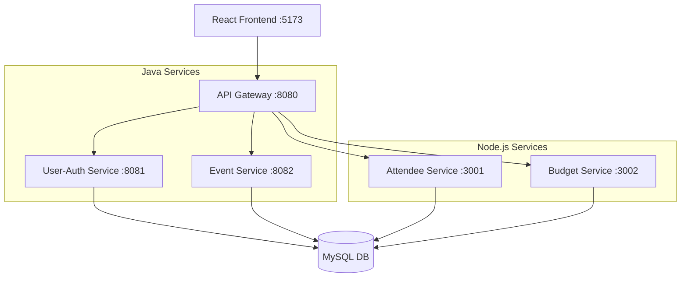

EventZen is a state-of-the-art, polyglot microservices platform built for the **Deloitte Capstone Project**. It streamlines event organization, attendee management, and real-time budget tracking through a decoupled, scalable architecture.

## Architecture



##  Tech Stack

| Layer | Technology |
|-------|-----------|
| **Frontend** | React.js (Vite) + Lucide Icons |
| **API Gateway** | Spring Cloud Gateway (Reactive) |
| **Backend (Java)** | Spring Boot 3 + Spring Security + OpenFeign |
| **Backend (Node)** | Node.js + Express + Sequelize ORM |
| **Database** | MySQL 8 (Isolated database-per-service) |
| **Authentication** | JWT (Stateless JSON Web Tokens) |
| **Documentation** | SpringDoc OpenAPI (Swagger) |
| **Containerization** | Docker & Docker Compose (Multi-stage builds) |

---

##  Microservices Inventory

| Service | Technology | Port | Database Name |
|---------|------------|------|---------------|
| `api-gateway` | Spring Cloud | 8080 | — |
| `user-auth-service` | Spring Boot | 8081 | `eventzen_users` |
| `event-service` | Spring Boot | 8082 | `eventzen_events` |
| `attendee-service` | Node.js | 3001 | `eventzen_attendees` |
| `budget-service` | Node.js | 3002 | `eventzen_budgets` |
| `frontend` | React + Nginx | 5173 | — |

---

## 🛠️ Getting Started

###  Method 1: Docker (Fastest & Recommended)
Use Docker Compose to spin up the entire cluster with one command.
```bash
docker-compose up --build -d
```
- **Web UI:** [http://localhost:5173](http://localhost:5173)
- **API Docs:** [http://localhost:8080/swagger-ui.html](http://localhost:8080/swagger-ui.html)

### Method 2: Manual Development
1. **Database:** Initialize MySQL schemas using `init.sql`.
2. **Java Services:** Use `mvn spring-boot:run` in individual folders.
3. **Node Services:** Use `npm install && npm start`.
4. **Frontend:** Use `npm install && npm run dev`.

---

##  Features

###  Identity & Access
- JWT-based authentication with role-based dashboard views.
- Secure password hashing via BCrypt.
- Separated flows for **Organizers** and **Attendees**.

###  Event Orchestration
- Create and manage events with rich metadata (Title, Range, Capacity).
- Secure deletion logic with Ownership Verification (Organizers can delete only their own events).

###  Attendee Management
- Real-time RSVP tracking.
- Automated registration verification.

###  Budget Intelligence
- Per-event budget allocation.
- Categorized expense logging (Venue, Catering, Marketing, etc.).
- **Over-Budget Protection:** Prevents logging expenses that exceed allocated limits.
- Floating visual progress bars for financial oversight.

---

##  Project Structure
```
├── api-gateway/              # Unified gateway & Swagger aggregator
├── user-auth-service/        # Auth & Identity (Java)
├── event-service/            # Event Management & Feign Clients (Java)
├── attendee-service/         # RSVP & Attendee tracking (Node.js)
├── budget-service/           # Expense & Budget logic (Node.js)
├── frontend/                 # Premium React UI (Vite + Nginx)
├── init.sql                  # Automated DB Schema creation
└── docker-compose.yml        # Orchestration Blueprint
```

##  License
This project is submitted as a final Capstone Project for CloudThat.

