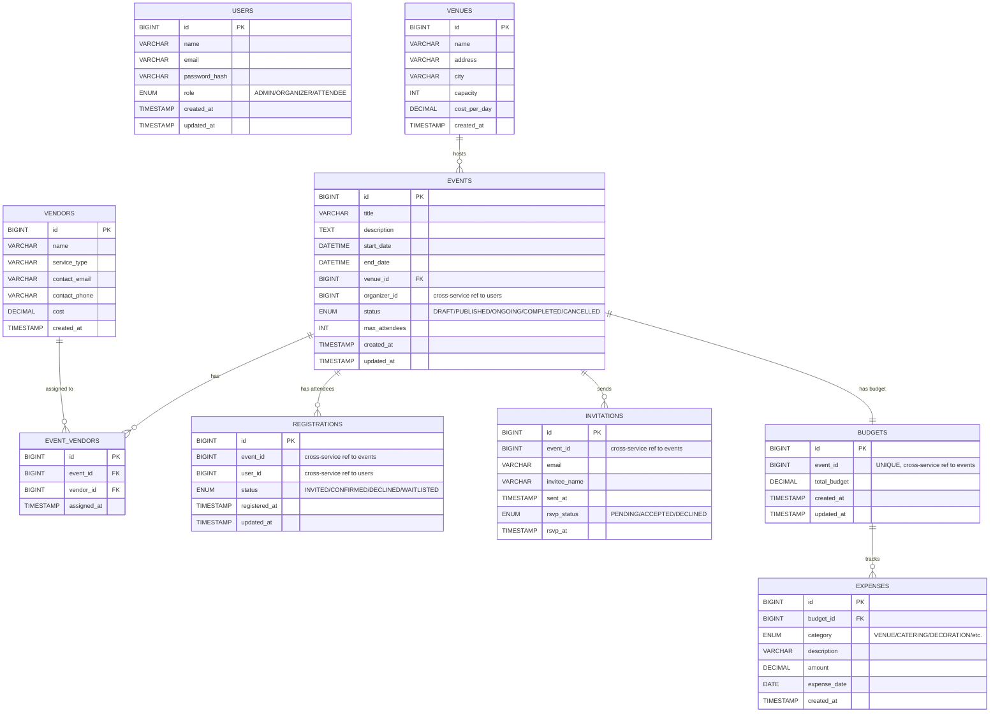
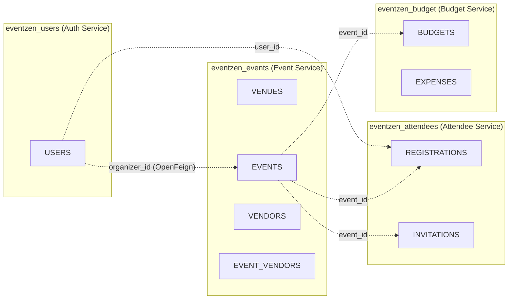

# EventZen — ER Diagram

## Complete Entity-Relationship Diagram

## Database Boundaries (Microservice Pattern)

> Dotted lines = cross-service references (stored as IDs, not enforced by FK). Event Service uses **OpenFeign** to call Auth Service for user details.
