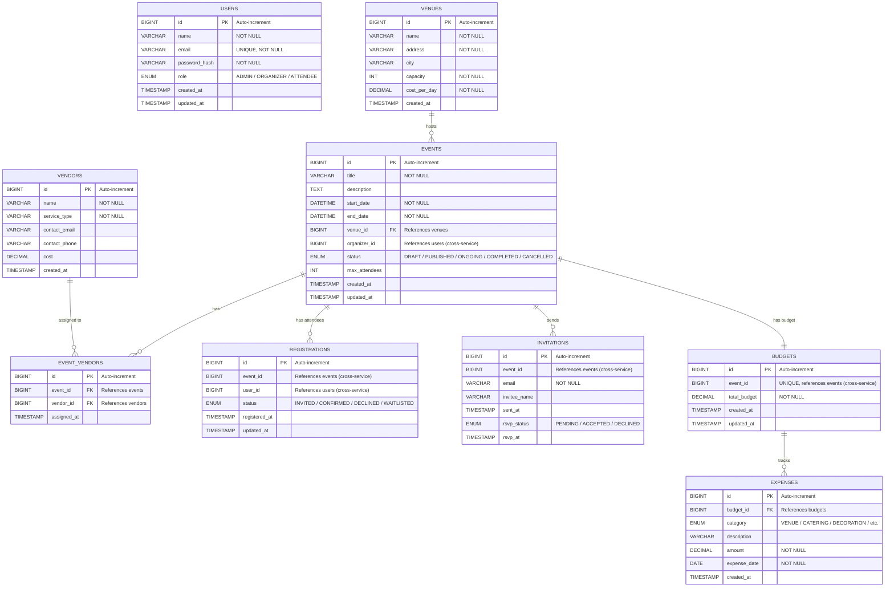
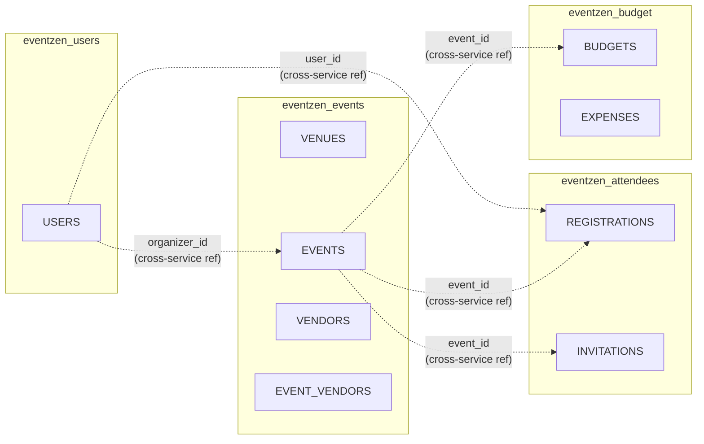

# EventZen — ER Diagram

## Complete Entity-Relationship Diagram

## Database Boundaries

> **Note:** Dotted lines represent cross-service references. These are stored as IDs but NOT enforced by foreign keys since they span different databases. The application layer ensures consistency.
