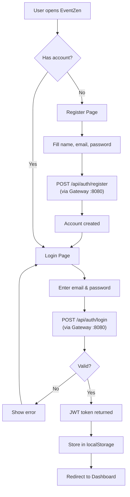
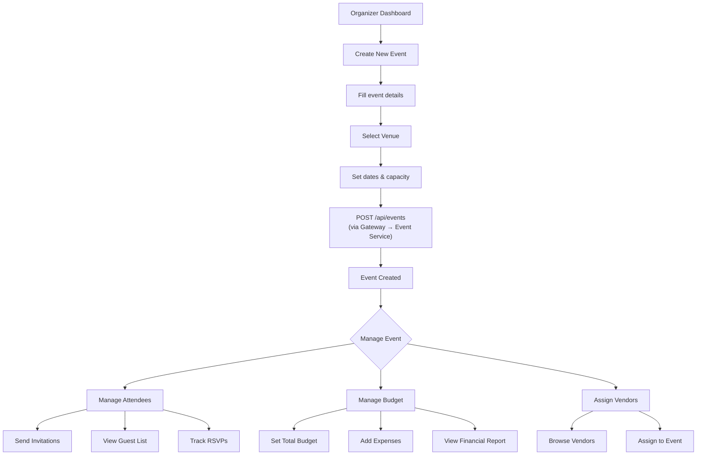
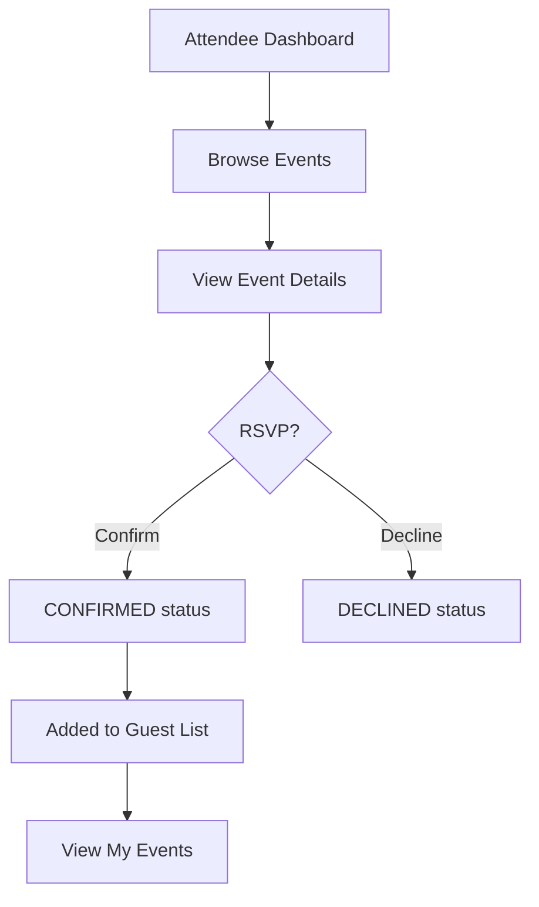
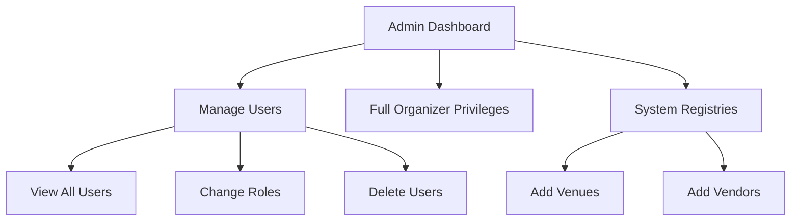
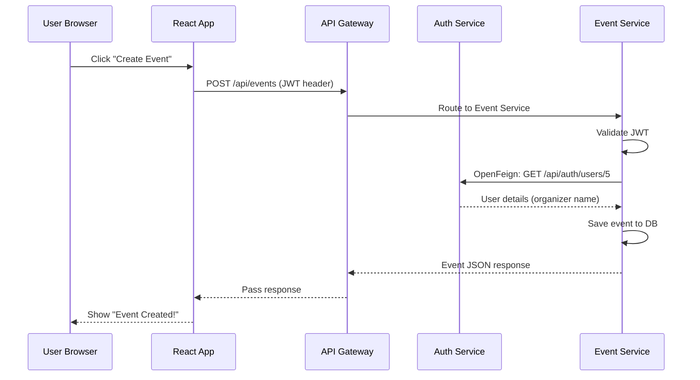

# EventZen — User Flow

## User Roles
- **Admin** — Full system access, manages users and venues
- **Organizer** — Creates and manages events, attendees, budgets
- **Attendee** — Browses events, RSVPs, views details

## Authentication Flow

## Organizer Flow

## Attendee Flow

## Admin Flow

## Request Flow Through System

