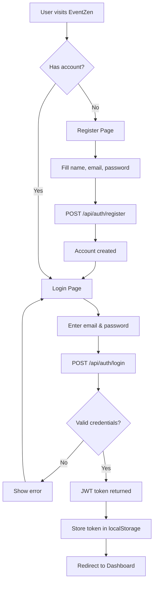
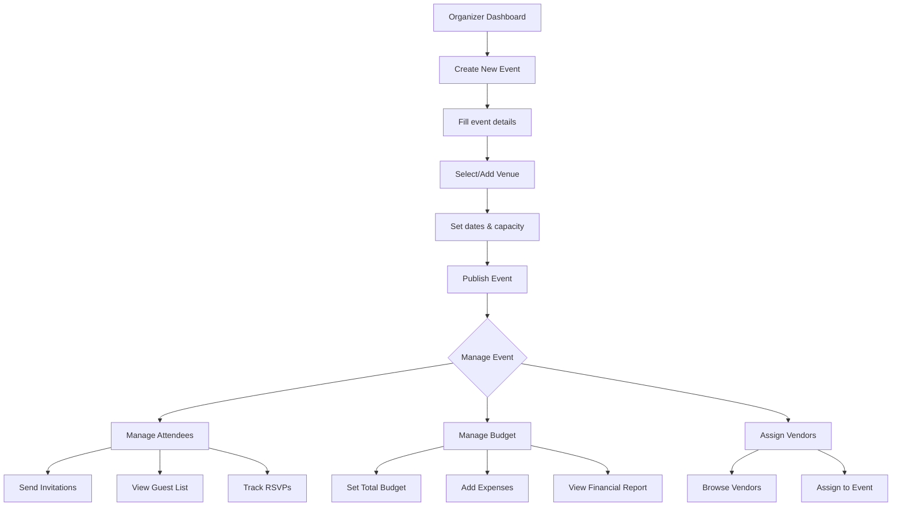
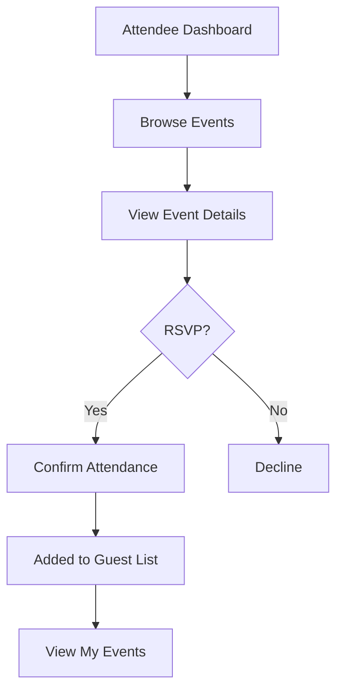
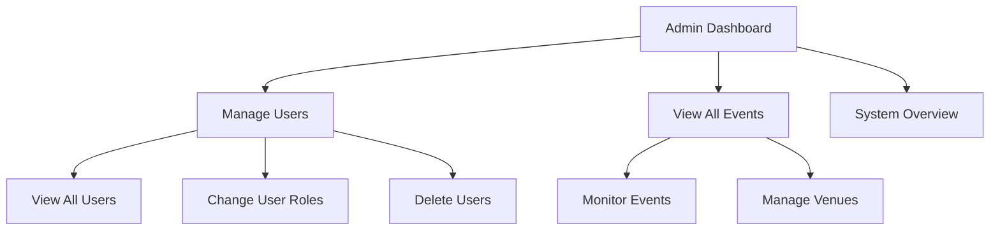

# EventZen — User Flow

## User Roles
- **Admin** — Full system access, manages users
- **Organizer** — Creates and manages events, attendees, budgets
- **Attendee** — Browses events, RSVPs, views details

## Flow Diagrams

### Registration & Authentication Flow

### Organizer Flow

### Attendee Flow

### Admin Flow

